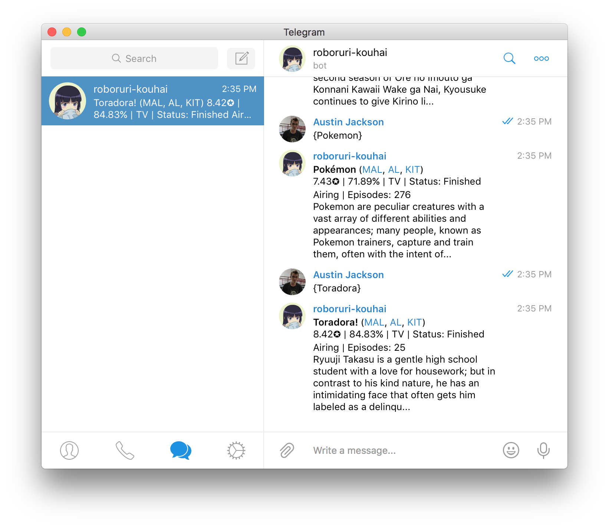
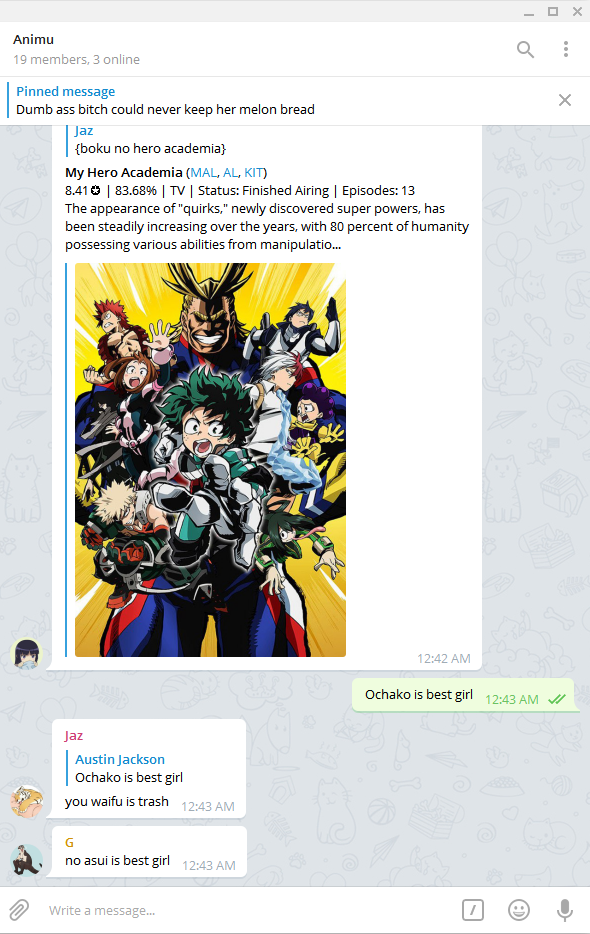
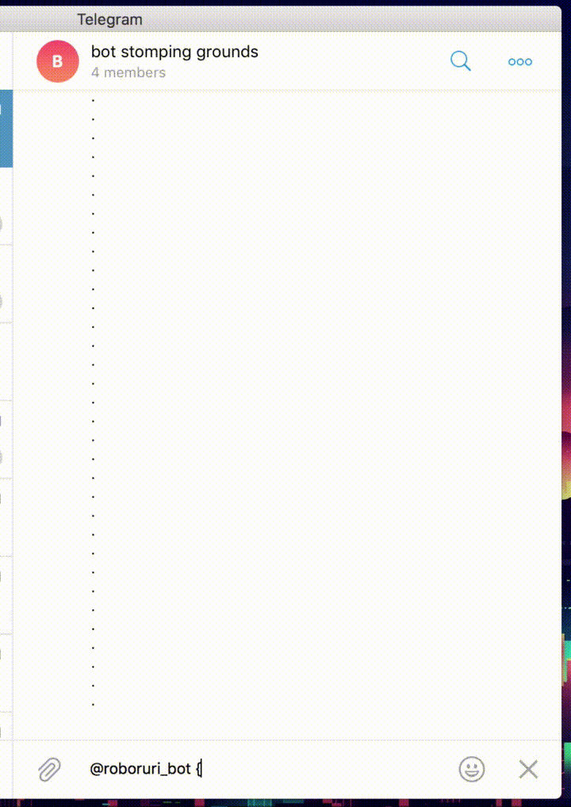

  

# Roboruri

Roboruri is a Telegram bot (based off of [/u/Roboragi](https://www.reddit.com/user/Roboragi/)) which creates anime and manga links from MyAnimeList, Anilist, and Kitsu when requested. To credit the author of /u/Roboragi for all their assistance in the development, this project is a fork of it and is prominently visible.

Thanks [Nihilate](https://github.com/Nihilate)~!

## Update 2019-03-24

#### Roboruri in utero

Roboruri was developed and inspired by /u/Roboragi as a passion project to spice up my group chats. When Roboruri was forked in June 2017, the latest commit into /u/Roboragi was [9fe1e0f](https://github.com/au5ton/Roboruri/tree/9fe1e0fdfb60793bead0b6d9f9076e63cf45b809) from 7 months prior. At the time, /u/Roboragi sourced its anime data from MyAnimeList, LNDB.info, mangaupdates.com, novelupdates.com, Kitsu (formerlly Hummingbird), Animeplanet, and Anilist. The sources of the anime data used by /u/Roboragi had been (to my limited knowledge) relatively stable and I had no reason to think that drastic changes were ahead.

Starting out on Roboruri [from scratch](https://github.com/au5ton/Roboruri/commit/749e9fd28ddea1a8a72595d97fccf1860baa6d2d), I had just graduated high school and was waiting for my first semester of engineering school at Texas A&M in August 2017. I had a feeling that I wouldn't be able to maintain her as much while in school, so I wanted to reach a finished product as fast as possible.

As a result, I limited my scope on what databases to use and focused on anime. I decided to aim to support MyAnimeList, Anilist, and Kitsu, as they seemed to be the most popular and complete websites. This is why Roboruri's light-novel and manga support has unfortunately always seemed like an afterthought.

#### Sunsetting Roboruri 

Around May 2018, MyAnimeList disabled many features on their website and took their entire API offline citing some security vulnerabilities with their systems. To date, their api is still offline with the [last update](https://myanimelist.net/forum/?topicid=1740204&show=400#msg56198138) being from November 2018. 

Anilist deprecated and later shutdown their REST APIv1 in support for their GraphQL APIv2 on May 1st 2018. Using APIv2 with Roboruri would require heavy refractoring to Roboruri's codebase that I didn't have time to implement at the time.

On March 21 2019, Kitsu took their website down to graciously ask for financial support in running the platform, which rendered Roboruri unable to access any of the APIs it had support for.

As a result of anime databases becoming unsupported, Roboruri's title recognition had progressively become less reliable than it had originally been. Meanwhile, college has been more and more demanding every semester and my time to work on Roboruri was essentially zero. Kitsu going down for a brief period was the necessary wakeup call to take Roboruri offline.

#### The future

In reponse to MAL being taken down, tools such as [Jikan](https://github.com/jikan-me/jikan) have emerged. Anilist's APIv2 is available and ready to be plugged into. Kitsu is back online after being supported by donors. The stage is set for Roboruri to be updated, but when or if is still yet to be determined.

When researching and developing Roboruri, I learned a lot about Javascript, [anime](https://github.com/au5ton/Roboruri/issues/6), and programming practice along the way. This was absolutely invaluable for someone who had previously only worked on projects outside of an academic setting for *me* to use. This was my very first project for *other* people to use and for me to support.

For the support of the users and other developers along the way, I am sincerely grateful.

For now, I'd like to endorse a project to supercede Roboruri. The developer is pretty cool and has made a really great product. I personally use this bot within my groups:

Developer: https://telegram.me/farmy

Source: https://github.com/Fazendaaa/AnilistBot

Bot: https://telegram.me/ANILISTbot

## Telegram Channel

When updates posted here are pushed into production, you can get notified by following the roboruri_bot_updates Telegram channel.

https://t.me/roboruri_bot

https://t.me/roboruri_bot_updates

## Running an instance

Roboruri is written in Node.js v8.x, however she might work on lower versions like v6.x, but keep that in mind if any problems reveal themselves. To get started:

- `git clone https://github.com/au5ton/Roboruri.git`
- `cd Roboruri`
- `npm install`
- `cp .env.example .env`
- `nano .env` (edit the config file somehow)
- Fill everything out.
- `screen -S my_bot` (start a new screen session)
- `node bot.js` (start the bot)
- Look for any errors during the startup checks
- your bot is running persistently
- To detach of the screen session, use `CTRL+A` then `CTRL+D`.

Please don't run any of these unless you know what you're doing. If you encounter issues, I encourage you to report them here. If not, you could just use the official bot instead: <https://t.me/roboruri_bot>

## How it works

First, Roboruri plugs into [`telegraf`](https://npmjs.com/telegraf) to interact with Telegram and wait to be summoned. Once summoned, Roboruri checks the local cache and [synonym database](https://github.com/Nihilate/Roboragi/blob/fc4c2f06bd7410a23c302529165a86a33b68f9fc/roboragi/reference.db) for common/slang names to improve recognition. If nothing is found, an array of Promises are set loose on some anime databases. Once all Promises have resolved, the search results are indexed into instances of an `Anime` class. Instances of `Anime` can be consolidated with [`Object.assign()`](https://developer.mozilla.org/en-US/docs/Web/JavaScript/Reference/Global_Objects/Object/assign) with some extra tinkery, which means multiple datasources can be combined easily.

Before consolidating the results, the result that best matches the query is calculated using [`string-similarity`](https://npmjs.com/string-similarity), which calculates a string's Dice's Coefficient. Once the best match for a title has been calulated across formats (romaji, english, japanese), the Assumed Real Title (ART) is used to reverse lookup the corresponding anime from the aforementioned search results.

Using the ART, the search results are consolidated into one `Anime` instance and is then used to print out:

### Spices up your group chats

### Inline summons

In addition to automatically "jumping in" when being summoned (akin to /u/Roboragi), Roboruri can be summoned as an inline bot to chats she's not even a part of:

#### [[demo video]](https://www.youtube.com/watch?v=tTV7xkHvmr8)

## What's with the name?

There were already existing bots on Telegram named 'roboragi' and other renditions (all of them seemed dead), so I decided on an alternative name that follows the naming tradition that /u/Roboragi set.

/u/Roboragi is named after [Araragi from Monogatari](http://bakemonogatari.wikia.com/wiki/Koyomi_Araragi), while Roboruri is named after [Ruri Gokou from Oreimo](http://oreimo.wikia.com/wiki/Ruri_Gokou).

## Picture

The profile picture of roboruri_bot is from NFGL on DeviantArt:

https://nfgl.deviantart.com/

The profile picture of the roboruri_bot_updates channel is from Dekodere on DeviantArt:

https://dekodere.deviantart.com/

## Fun Facts

- Roboruri used to be named Roborugi for about 2 days when I couldn't decide on a name yet

## What's the point of all this?

Shhhh.
