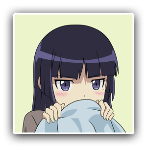

# Roboruri
Roboruri is a Telegram bot (based off of [/u/Roboragi](https://www.reddit.com/user/Roboragi/)) which creates anime and manga links from [undecided] when requested. To credit the author of /u/Roboragi, this project is a fork of it and is prominently visible.

## Running an instance
Roboruri is written in Node.js. Node.js **version 6 and above is required** because ES6 features, however this project is debugged using Node v8.x, so keep that in mind if any problems reveal themselves. To get started:
- `git clone https://github.com/au5ton/Roboragi.git`
- `cd Roboragi`
- `npm install`
- `cp .env.example .env`
- `nano .env` (edit the config file somehow)
- Fill everything out.
- (Optional) add your Telegram ID so you can perform administrator tasks by talking to the bot (not documented yet).
- `screen -S my_bot` (start a new screen session)
- `node bot.js` (start the bot)
- your bot is running persistently
- To detach of the screen session, use `CTRL+A` then `CTRL+D`.

Please don't run any of these unless you know what you're doing. I'm not good at writing idiot-proof stuff, but if you're a developer you shouldn't have trouble. If not, you could just use the official bot instead: https://t.me/roboruri_bot

## How it works
will document when it's done

## What's with the name?
There were already existing bots on Telegram named 'roboragi' and other renditions (all of them seemed dead), so I decided on an alternative name that follows the naming tradition that /u/Roboragi set.

/u/Roboragi is named after [Araragi from Monogatari](http://bakemonogatari.wikia.com/wiki/Koyomi_Araragi), while Roboruri is named after [Ruri Gokou from Oreimo](http://oreimo.wikia.com/wiki/Ruri_Gokou).

## Picture
The photo is from NFGL on DeviantArt. They're really good at making vector art of moe. 100% shoutout:

https://nfgl.deviantart.com/

## Fun Facts
- Roboruri used to be named Roborugi for about 2 days when I couldn't decide on a name yet
